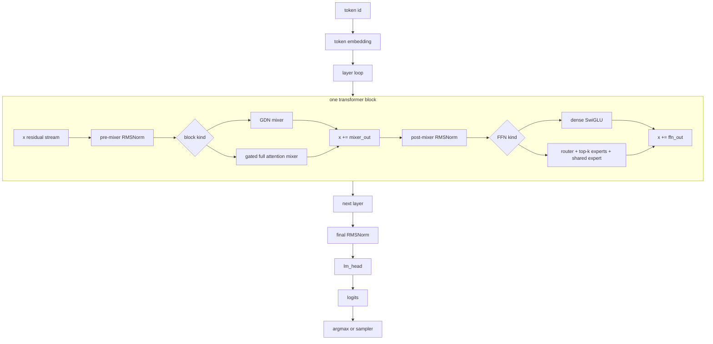
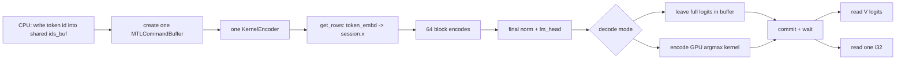
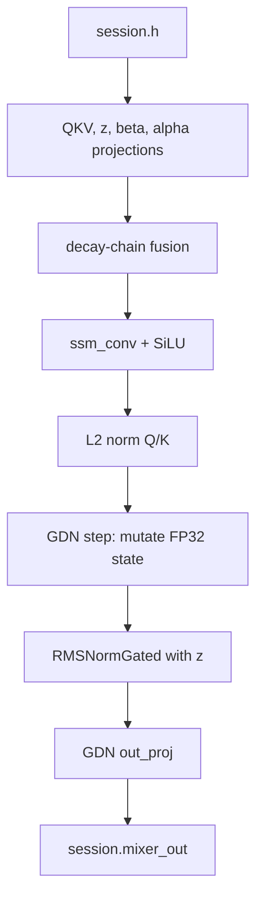
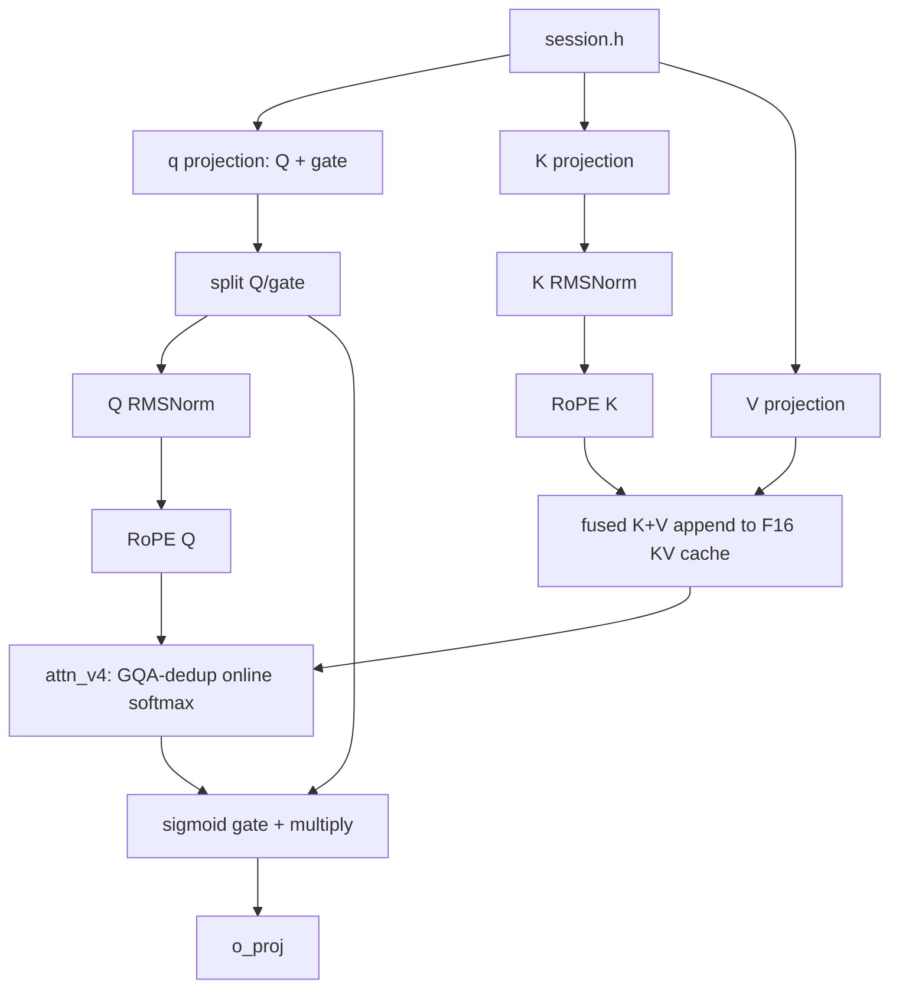
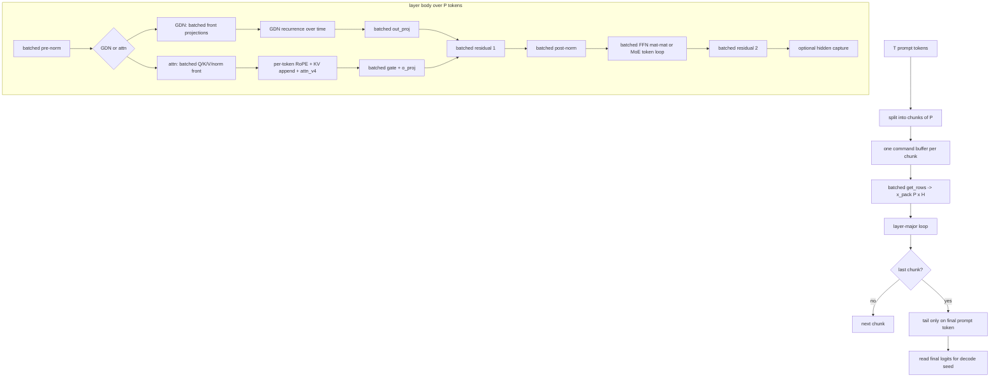
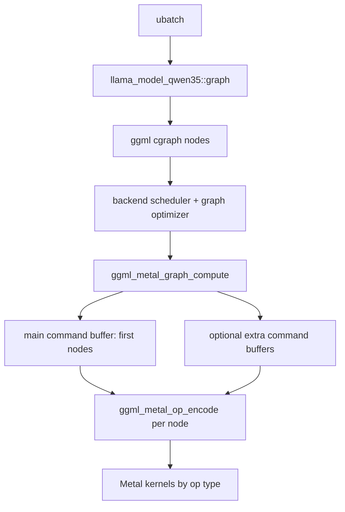
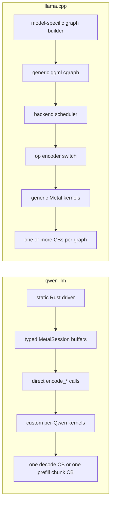
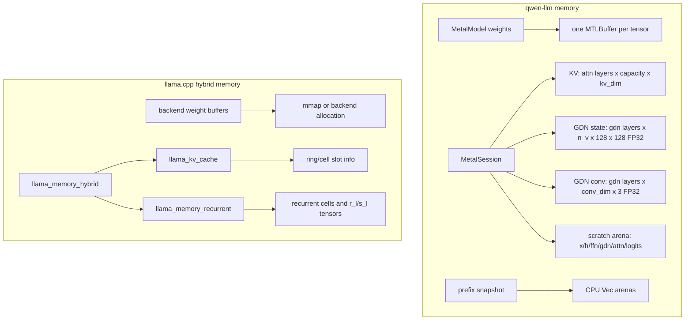
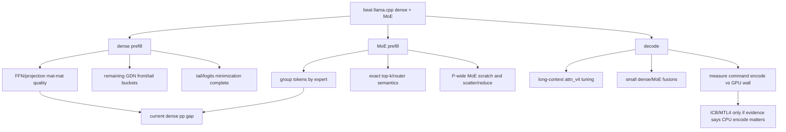

# Inference Work Graph

Semantic and visual map of how Qwen3.5/Qwen3.6 hybrid Gated DeltaNet inference
is executed in this engine and in llama.cpp. The goal is not just to redraw the
model. It is to name the engineering surfaces we can optimize: command encoding,
kernel boundaries, state movement, memory layouts, and where prompt processing
and token generation diverge.

Primary local references:

- This engine: `crates/qwen-llm/src/metal_forward.rs`,
  `crates/qwen-llm/src/metal_dflash.rs`, `kernels/`.
- llama.cpp: `/Users/tito/code/llama.cpp/src/models/qwen35.cpp`,
  `/Users/tito/code/llama.cpp/src/models/qwen35moe.cpp`,
  `/Users/tito/code/llama.cpp/ggml/src/ggml-metal/`.
- Current performance context: `docs/PERF-ROADMAP.md`, `docs/PERF-LOG.md`.

## 1. Shared Semantic Model

Dense and MoE variants share the same hybrid backbone:

- Layer schedule: `[GDN, GDN, GDN, full-attn]` repeated.
- GDN layers own a constant-size recurrent state plus a short conv state.
- Full-attn layers own a context-growing KV cache.
- Dense models run a normal SwiGLU FFN after each mixer.
- MoE models replace that FFN with routed experts plus a gated shared expert.

The semantic graph is nearly identical between engines because llama.cpp is the
correctness oracle. The performance differences are in how that graph is lowered
to Metal work.

## 2. qwen-llm Decode Graph

Decode is one input token at one position. The current production shape is one
Metal command buffer per token, one compute encoder, many hand-encoded kernels,
then either full logits readback or GPU argmax readback.

Within a dense block:

Within a full-attn block:

Decode memory roles:

- `MetalModel`: persistent weight tensors, mostly native GGUF dtypes for hot
  matmuls (`F32`, `Q4_K`, `Q5_K`, `Q6_K`, `Q8_0`).
- `MetalSession`: per-sequence mutable state and scratch: GDN conv, GDN state,
  KV cache, activation buffers, logits, argmax, and MoE route buffers.
- `StorageModeShared`: unified-memory buffers, so CPU readback/writeback is a
  raw pointer copy after command completion, not an explicit device transfer.

## 3. qwen-llm Prompt Prefill Graph

Prompt processing is now a different execution graph than decode. It processes
prompt chunks of `P` tokens in a layer-major order to maximize mat-mat reuse.

What this buys:

- Weight-heavy projections and dense FFN legs read each weight matrix once per
  chunk instead of once per token.
- All-but-last prompt tokens skip final `lm_head`, avoiding dead logits work.
- Dense defaults now use a large chunk (`P=512`) and saturate once the whole
  prompt fits in one chunk on the common same-prompt benchmark.
- Dense GDN prompt work now also batches the small F32 `alpha`/`beta`
  projections and runs `gdn_step_decay` across prompt tokens inside one packed
  kernel, so the remaining dense prompt gap is no longer mostly recurrent glue.
- MoE packed prefill is currently stage 1: mixer prep and post-norm batch over
  `P`, while routed expert execution is still token-by-token for exact routing.
  MoE defaults use a tuned conservative chunk (`P=128`) because grouped routed
  expert execution has not landed yet.

## 4. llama.cpp Execution Graph

llama.cpp lowers the same semantic model through ggml. The model file builds a
graph of generic tensor ops; the backend scheduler assigns buffers/backends; the
Metal backend walks the graph nodes and encodes kernels.

Important llama.cpp details:

- Qwen dense path is built in `/Users/tito/code/llama.cpp/src/models/qwen35.cpp`.
- Qwen MoE path is built in `/Users/tito/code/llama.cpp/src/models/qwen35moe.cpp`.
- Hybrid memory is split between `llama_kv_cache` for attention layers and
  `llama_memory_recurrent` for GDN/conv state.
- Metal graph compute can encode graph slices on a main thread plus `n_cb`
  async command buffers; llama.cpp defaults the Metal backend to `n_cb=1`.
- Individual nodes dispatch generic op kernels such as `MUL_MAT`,
  `MUL_MAT_ID`, `SSM_CONV`, `GATED_DELTA_NET`, `ROPE`, `SET_ROWS`,
  `FLASH_ATTN_EXT`, and elementwise ops.

## 5. Side-by-side Lowering

| Surface | qwen-llm | llama.cpp | Why it matters |
| --- | --- | --- | --- |
| Graph representation | Static driver code and typed session fields | Dynamic ggml cgraph of tensor ops | We remove graph-walk abstraction cost; llama gets flexibility. |
| Decode submission | One command buffer per token, explicit wait/readback | Backend graph compute, usually async until scheduler sync | Our latency model is simpler; llama can overlap graph encoding more. |
| Prefill scheduling | Layer-major chunk graph designed for Qwen hybrid | Generic ubatch graph with ggml mat-mat/mul_mat_id nodes | Our chunk size and skip-tail are explicit optimization knobs. |
| Weight layout | Native hot dtypes kept in `MetalTensor`; some required F32 tensors dequant at load | Backend buffers can mmap/copy from GGUF; generic tensor layout | llama has mature storage/offload; we choose hot-path-specific seams. |
| KV cache | Per-attn-layer F16 buffers in `MetalSession`; experimental Q8 path | `llama_kv_cache` ring/cell model, K/V type configurable | llama has mature multi-seq/cache management; ours is lean single-stream. |
| GDN state | FP32 per-GDN-layer state mutated directly by kernels | Recurrent memory cells, state tensor read/write via graph ops | llama is general across sequence management; ours avoids generic state plumbing. |
| MoE route | GPU top-k/shared gate, routed expert bank kernels; packed prefill token loop | `build_moe_ffn`/`MUL_MAT_ID` style generic route execution | We have direct control; grouped packed prefill is still open. |

## 6. Memory Topology

Concrete sizes for the dense 27B shape:

- Full-attn KV: 16 attention layers, 4 KV heads, 256 head dim, K+V F16 =
  about 64 KiB per token.
- GDN recurrent state: 48 GDN layers, 48 V heads, 128 x 128 FP32 = about
  144 MiB total and independent of context length.
- GDN conv state is small but latency-sensitive because it is touched every GDN
  layer and every token.

## 7. Kernel Structure Comparison

| Component | qwen-llm kernel structure | llama.cpp kernel structure | Current read |
| --- | --- | --- | --- |
| Q4/Q5/Q6 mat-vec | Native decode dispatch by dtype; Q4 fused FFN gate+up for dense SwiGLU | Mature generic `mul_mv_*` family | We match/lift the strong base, then specialize fused work where Qwen repeats patterns. |
| Q4/Q5/Q6 mat-mat | Layer-major prefill `encode_mat_mat_dispatch`; Q4 has lifted simdgroup-matrix tile plus specializations | Mature `mul_mm_*` kernels and tensor-path variants | Remaining prefill gap likely includes broad FFN/projection mat-mat quality. |
| GDN recurrence | `kernel_gdn_step_decay_f32` mutates state; dense prompt now uses `kernel_gdn_step_decay_packed_f32` to keep each state row resident across P tokens | `kernel_gated_delta_net_f32_{1,2,4}` loops over `ne22` timesteps and returns output + new state through ggml dst | Packed step is now a confirmed dense prompt win; llama's multi-token GDN shape remains a useful reference for the remaining tail work. |
| GDN alpha/beta | Dense prompt batches the small F32 `beta_proj`/`alpha_proj` surfaces and the decay chain across `[P, n_v]`; decode still uses per-token fused decay chain | Generic graph: matmul, add, softplus, mul, reshape, then GDN op | This was a confirmed prefill win; alpha/beta is no longer a dense prompt bottleneck. |
| SSM conv | `ssm_conv_silu` fused in our GDN tail | `SSM_CONV` then `SILU`, with batched variants for prefill | Potential fusion/scheduling lever remains small compared to FFN and GDN step. |
| Full attention decode | `attn_v4` groups sibling Q heads per KV head and reads K/V once per GQA group; split-K over context | Generic attention path through ggml ops / flash-attn kernels | Our GQA-dedup attention is a concrete long-context advantage. |
| KV append | Fused K+V scatter to F16; optional Q8 experiment | `SET_ROWS`/cache helpers, configurable cache types | Our Q8 experiment lost on M4 for the current reader; F16 is still best. |
| Dense FFN decode | Fused Q4 gate/up SwiGLU plus down mat-vec | `build_ffn` through generic matmul/GLU ops | This is a direct decode win surface. |
| MoE decode | GPU route prep, top-k + shared gate fusion, expert-bank kernels for routed/shared paths | `build_moe_ffn` with generic MoE graph and `MUL_MAT_ID` style execution | Decode is strong; packed prefill needs grouped routed experts. |
| Final sampling | GPU argmax path avoids full logits readback in greedy decode | llama.cpp has mature sampling stack; logits handling depends on caller | GPU argmax is modest for MoE, neutral dense, but simplifies greedy fast path. |

## 8. What We Learned From llama.cpp

- The semantic graph and tensor naming are the oracle. Both dense and MoE
  loader/forward order were validated against llama.cpp's qwen35 builders.
- GGUF is a pragmatic distribution format, but not the hot-path abstraction.
  We keep the codec seam while refusing the generic graph executor as the
  performance ceiling.
- The Metal K-quant kernels are strong. Our mat-vec and mat-mat kernels are
  heavily informed by/lifted from llama.cpp's proven tiles.
- The GDN kernel shape in llama.cpp is important: it encodes a multi-token loop
  inside `kernel_gated_delta_net_impl`, with NSG/function-constant variants.
  Our packed GDN step is converging toward the same insight, but under a static
  Qwen session layout.
- The mature cache/scheduler code is still a reference for multi-sequence,
  prefix reuse, cell/ring management, and backend portability.

## 9. Where qwen-llm Has Surpassed the Baseline

- Decode graph control: direct Qwen-specific encoding avoids generic cgraph walk
  and lets us fuse exact hot patterns.
- Attention v4: GQA-dedup reads K/V once per KV head group and shares across all
  sibling Q heads, which the local kernel comments call out as absent from the
  reference engines.
- Dense FFN decode: fused Q4 gate/up SwiGLU shares input loads and removes gate/up
  materialization.
- Prompt prefill: layer-major chunks, skip-tail prefill, tuned chunk sizes,
  batched GDN alpha/beta, packed GDN step, and lighter no-spec scratch materially
  moved dense prompt throughput and narrowed the same-prompt gap to llama.cpp.
- Greedy decode readback: GPU argmax avoids pulling the full vocab row for the
  common no-sampling path.
- MoE single-token path: GPU router/top-k/shared-gate and expert-bank kernels keep
  decode GPU-resident and explain the strong MoE decode numbers.

## 10. Where llama.cpp Still Teaches Us

- Prefill FFN/projection mat-mat quality: dense prompt attribution now points at
  FFN / projection mat-mat as the largest dense bucket, and exact-shape prompt
  audits show our current chained prompt mat-mat throughput is still low for the
  real 27B prompt surfaces. This is the main dense place where llama.cpp still
  teaches us.
- Multi-token GDN recurrence: our packed step is a win, but llama.cpp's fused
  GDN op is still a useful reference for long prompt timesteps and function
  constant specialization.
- MoE prompt execution: llama.cpp's generic MoE machinery is not the end state
  for us, but it is still the best correctness/shape reference while building
  grouped routed expert execution.
- Scheduler maturity: llama.cpp's backend scheduler and command-buffer encoding
  can overlap CPU encoding with GPU execution. We need evidence before ICB/MTL4,
  but the design space is real.
- Cache management: our single-stream session is fast and simple; llama.cpp's
  ring/cell/cache abstractions are still ahead for generalized batching,
  prefix reuse, and sequence manipulation.

## 11. Optimization Map

Concrete next instrumentation that would make the graph more actionable:

- Emit a per-command-buffer DAG trace for `single_token_argmax` and packed
  prefill: `phase`, `layer`, `kernel`, `bytes read estimate`, `GPU ms`.
- Mirror the same taxonomy for llama.cpp by parsing ggml debug node names or a
  Metal capture: `ggml op`, `model layer`, `kernel`, `GPU ms`.
- Normalize both traces into a shared schema so we can render flame graphs and
  node-edge diagrams side by side.
- Add shape labels (`H`, `F`, `P`, `n_pos`, `dtype`) to every kernel event so
  runs at 4K/16K/32K can be compared semantically, not just by elapsed time.
